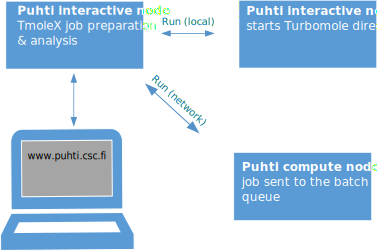
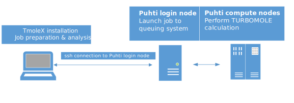
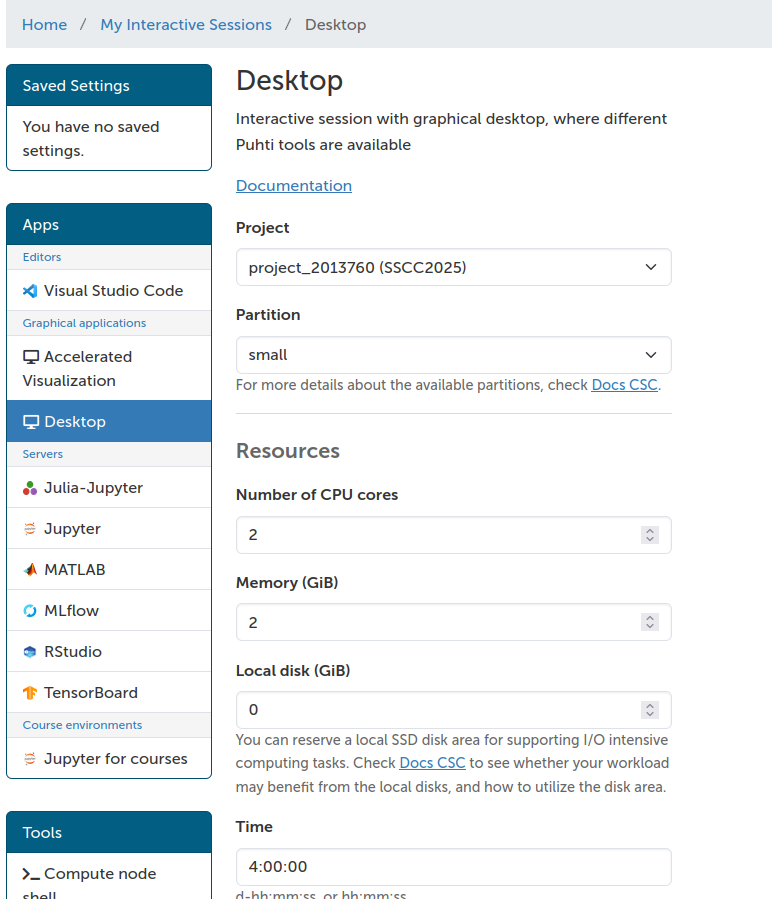
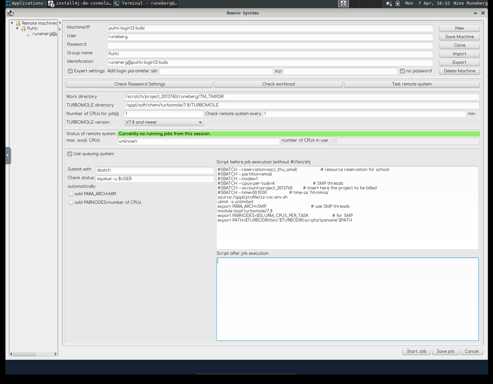

# Using TmoleX to Run TURBOMOLE Jobs on Puhti

This guide helps you set up the TmoleX graphical interface to run TURBOMOLE calculations on CSC's Puhti supercomputer.

## Setup TmoleX

[TmoleX](https://www.3ds.com/products/biovia/turbomole) is a user-friendly graphical interface for preparing, submitting, and analyzing TURBOMOLE jobs. It includes a structure builder and tools to manage calculations, both locally and on remote HPC systems such as CSC's Puhti. You can run TmoleX in two ways:

* Via browser through CSC’s remote desktop interface.
* Locally on your desktop and submit jobs to Puhti over the network.

The free TmoleX Client version can be used from your local Windows, Linux, or macOS desktop to run TURBOMOLE at CSC. It can be downloaded (registration required) from the [Dassault Systèmes website](https://discover.3ds.com/free-download-biovia-turbomole-demo-version). This demo version includes a restricted version of TURBOMOLE.


<div style="display: flex; gap: 20px; justify-content: space-between; align-items: flex-end;">
  <figure style="width: 45%; text-align: center; margin: 0;">
<a href="../img/tmolex-and-ood.svg" class="lightbox">
    
    <figcaption>Using TmoleX via the browser</figcaption>
</a>
  </figure>
  <figure style="width: 45%; text-align: center; margin: 0;">
<a href="../img/tmolex-and-puhti_new.svg" class="lightbox">
    
    <figcaption>Using TmoleX from your local pc</figcaption>
  </figure>
</a>

</div>

## Usage

### Use TmoleX via browser

1. Open [puhti.csc.fi](https://puhti.csc.fi) in your browser and log in with your CSC/Haka credentials.

2. Launch a Desktop session.
   [](../img/ood_01.png)

3. In the Desktop launcher:

    - Activate reservation: `sscc_thu_small`
    - Project: `project_2013760 (SSCC2025)`
    - Partition: `small`
    - Use the default resources and submit the request

    [](../img/ood_02.png)

5. Once resources are allocated, launch the Desktop.
6. Open a terminal and load TURBOMOLE: `module load turbomole/7.8` 
7. Start TmoleX with the command `TmoleX24`.


### Prepare TmoleX for batch jobs

* Select `New Project` and define a project path (e.g. `/scratch/project_2013760/<your-username>/qc_tutorial1`).
* Go to `Extras->Preferences->General` and set  `User directory` to `/scratch/project_2013760/<your-username>`
* Small jobs can be run interactively, but for larger jobs you should use the queue system. 

Now configure the remote machine:

1. In TmoleX open `Extras->Remote Systems->Add new Machine`
2. Set Machine name to `puhti-login12.bullx`  

    [](../img/tmolex_7.png)

3. `User` is your CSC username, `Group name` and `Identification` are just tags you can set to distinguish different configurations  
4. Tick `Expert settings` and `no password`.  
5. Work directory is a place where temporary files are stored:
   `/scratch/project_2013760/<your-username>/TM_TMPDIR` 
6. TURBOMOLE directory should point to were it is installed:
   `/appl/soft/chem/turbomole/7.8/TURBOMOLE`
7. Tick `Use queuing system`
8. Submit with `sbatch` and Check status with  `squeue -u $USER`
9. Untick `add PARA_ARCH` and `add PARNODES`.

10. In the field "Script before job execution" add:
```    
#SBATCH --reservation=sscc_thu_small                  # resource reservation for school
#SBATCH --partition=small                             # queue
#SBATCH --nodes=1                                     # for SMP only 1 is possible
#SBATCH --cpus-per-task=4                             # SMP threads
#SBATCH --account=project_2013760                     # insert here the project to be billed
#SBATCH --time=00:30:00                               # time as `hh:mm:ss`
source /appl/profile/zz-csc-env.sh
ulimit -s unlimited
export PARA_ARCH=SMP                                  # use SMP threads
module load turbomole/7.8
export PARNODES=$SLURM_CPUS_PER_TASK                  # for SMP
export PATH=$TURBODIR/bin/`$TURBODIR/scripts/sysname`:$PATH
```

 *  **Remember to save the settings using `Save Machine`.**

### Install your own TmoleX

Install the TmoleX client on your local workstation. For details, see the
registration and download page at
[Dassault Systèmes website](https://discover.3ds.com/free-download-biovia-turbomole-demo-version).
With your version of TmoleX you can build your actual job locally and then
submit the job to Puhti. With the client you can monitor how the job proceeds.
When the job has completed you can retrieve the output and use your local
client to analyze the results.

